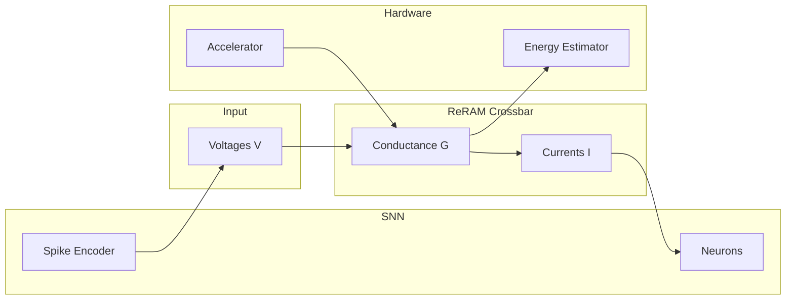

# Architecture

High-level block diagram and data flow: crossbar ↔ SNN ↔ hardware.

## Block diagram

## Data flow

1. **Input**: Voltages \(V\) (from spike encoder or external driver) are applied to crossbar rows.
2. **Crossbar**: Conductance \(G\) is stored at each cell; currents \(I = V \times G\) are read on columns.
3. **SNN**: Currents feed LIF neurons; spike encoder produces \(V\) from continuous inputs.
4. **Hardware**: Accelerator model holds tiles/crossbars; energy estimator uses \(E = V^2 \times G \times t\).

Code: `src/crossbar/` (ideal, non-ideal), `src/snn/` (encoder, neuron, network), `src/hardware/` (accelerator, controller, energy).
